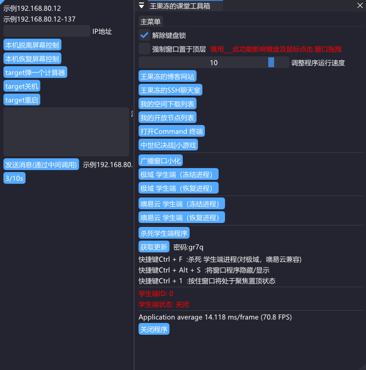

<h1 align="center">王果冻的课堂工具</h1>

### 功能介绍

- 解除键盘锁 - 国庆之前添加的一项功能 ，极域会HOOK键盘以达到阻止键盘输入 ，我将原本的HOOK写在计时器所调用的回调函数覆盖，每秒覆盖一次，即达到解除键盘锁，也不必在循环中浪费太多性能 

- 强制窗口置于顶层 - 在循环中调用 SetWindowPos(当前窗口句柄, HWND_TOP, 0, 0, 1280, 800, SWP_NOMOVE); 实现窗口的顶层设置 ， 由于它和极域都是顶层窗口所以极域也有可能覆盖它 ，所以我用调用窗口焦点SetForegroundWindow(当前窗口句柄); 它会因为焦点调用而处在极域窗口上面，也整因为焦点调用所以它在窗口显示时可能影响键盘和其他鼠标操作的焦点争夺，将窗口隐藏则不会焦点争夺

- 调整程序运行速度 - 这个简单 就是一个Int变量 在 Sleep(sleep_run); 中

- SSH聊天室 - 基于开源项目 Devzat | https://github.com/quackduck/devzat 

- 中世纪决战 | 小游戏 - 一个Flash小游戏

- 广播窗口最小化 - 获取的极域屏幕广播的窗口句柄 ，ShowWindow(窗口句柄, SW_MINIMIZE);

- 极域学生端 （冻结进程），是将进程挂起，至于冻结是让不懂技术的人也能容易明白其中的意思

- 极域学生端 （恢复进程）, 是将挂起的进程恢复运行

- 杀死学生端程序 - 终结极域 or 奥易云 进程

- Ctrl + 1 将课堂工具窗口处于聚焦状态 

- 我隐藏了控制台窗口要调出它的快捷键是：Ctrl + Shift + M

- 学生端状态，学生端ID - 是在回调函数中每隔1秒调用一次，实时去检测极域的运行状态

### 极域 Udp 重放攻击脚本功能  集成开源项目 | https://github.com/ht0Ruial/Jiyu_udp_attack

- target 弹一个计算器 - 目标IP且连通 极域的 机器控制弹出计算器

- target 关机 - 目标IP且连通极域的机器控制关机

- target 重启 - 目标IP且连通极域的机器控制重启

- 发送消息 - 将伪造成教师的消息，向目标IP发送,这个功能可能因为IMGUI框架的原因有编码的问题导致中文乱码

